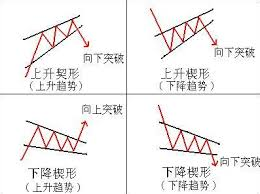
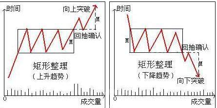
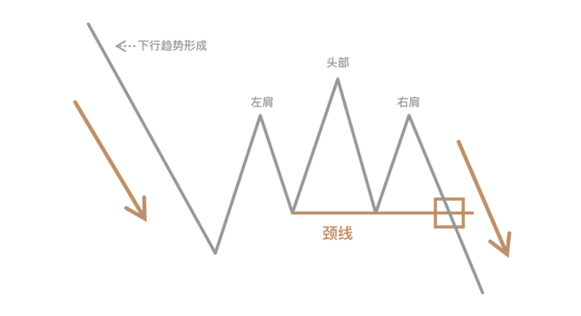

#### 1. 对称三角形

对称三角形（绕线筒）属于持续形态，表示既有趋势暂时处于休整，随后恢复发展。如果原先趋势向上（左图），因而最终可能性较大时向上突破来恢复原有方向；反之，则看跌。

对称三角的构成至少**4**个转折点，每条趋势线需要两个点。

形态的确立具有时间极限，及**两趋势线的交点**。一般在横向宽度的$1/2 \to 3/4$之间突破。如果价格一直局限在三角形内，也超过了3/4的范围，则三角形可能失去潜力，价格一直调整漂泊。

最后的趋势信号以收市价穿越趋势线为准，该趋势线相应变为支撑阻挡水平，有时候突破后会朝这条线反扑一下。

**交易量**随着在三角形内摆动幅度的**减小**，交易量也相应的**萎缩**。这种收缩倾向，在所有调整型形态都普遍存在。趋势线**突破**，交易量明显**增加**。**反扑**时交易量较轻。趋势恢复后，交易活动逐渐活跃。
##### 1.1 价格测算

1. 等距投影
   - 测出三角形最宽（底边）部分竖直距离
   - 从突破点顺势投射等距高度
2. 管道线法
    - 从底边端点处，作出相应趋势线的平行线
    - 这条管道线就是上升趋势上方的价格目标。（同时也是时间目标）

#### 2. 上升三角形

- 上边趋势线持平
- 下边线上升趋势线
- 看涨形态，向上突破作为形态确立
- 突破交易量显著增加，反扑时交易量较轻

上升三角形在强弩之末的下降趋势中有时候也以底部形态出现，上线的突破标志底部完成，依旧看涨信号。

随形态发展交易量萎缩，上升形态应该在上升时交易量稍重，下降时落轻。
##### 2.1 价格测算
1. **等距投影**
   - 测出三角形最宽（底边）部分竖直距离
   - 从突破点顺势投射等距高度

#### 3. 下降三角形

- 上升三角的镜像
- 看跌形态
- 上边下降趋势线，下边持平

有时候也能充当市场顶部。

随形态发展交易量萎缩，下降形态应该在下降时交易量稍重，上升时落轻。

#### 4. 扩大（喇叭）形态

- 反向三角形，两边线相互发散
- **交易量**：随价格摆幅变大而相应的扩张。市场失去控制，更情绪化。
- **市场顶部**，**反转形态**，**看跌**
- 一般上面三个**峰**，下面两个**谷**。第二个谷被向下穿越后形态完成
- 不适于交易
- 少见，但一旦出现，有可能就是重要顶部

#### 5. 钻石形态

- 前一半是扩散三角形，后一半是对称三角形
- 交易量前一半扩张，后一半随价格摆幅变小而减轻
- **市场顶部**，**反转形态**，**看跌**
- 后半部分，下边的上升趋势线突破后形态完成

钻石形态进行价格测算时，先测出该形态的最宽部分竖直距离，然后从突破点向下投射等距。

#### 6. 旗形和三角旗形

- **先决条件**：距离的、几乎是直线式的市场活动（“旗杆”的取名来源）。说明市场充满活力，也说明市场陡峭上升或下跌过于快速。
- 最可靠的持续形态
- 形态出现前的陡峭的价格上升伴随重大交易量
- 调整形成的过程中交易量萎缩
- 向上突破时交易量迸发
- 形态**周期短**

旗形形态与平行四边形或者矩形比较像。由两条**相反**趋势方向的趋势线围成。上升趋势中，旗形具有稍稍向下的倾角。

三角形态是两条相互聚拢的趋势线，像小的对称三角。

**价格测算**：旗形经常被比喻在旗杆**中点**降半旗。这类小型持续形态倾向于出现在整个运动中点，一旦形态确立，趋势恢复，市场重复原先另一半旗杆。
- 从原始突破点起计算先前运动的距离。起算点可以为价格穿越重要支撑阻挡水平，或者突破重要趋势线。
- 从突破点向趋势方向投射等距

#### 7. 楔形

- 两条相互聚拢的趋势线
- 楔形有明显的倾角，与流行趋势方向相反
- 两条趋势线应该同向
   - **上升楔形**：价格高点和低点同步上移，但高点上移幅度逐渐缩小，形成收敛的上升通道。
   - **下降楔形**：价格高点和低点同步下移，但低点下移幅度逐渐缩小，形成收敛的下降通道。
- 上升楔形看跌，下降楔形看涨
- 形成过程中交易量萎缩

通常是持续形态，但也可能出现在底部或者顶部附近，但反转出现的情况比较少见。上升趋势中，持续性楔形应该逆着流行趋势而倾斜向下，但出现不同寻常的上升楔形就是一个看跌不看张的重要信号。

#### 8. 矩形

- 价格在两条**平行直线**之间横向发展
- 矩形区间为交易密集区
- 既存趋势的调整区间，预测意义与堆成三角形类似
- 观察**交易量**很重要
  - 矩形间交易量不一定萎缩
  - 如果交易量在价格上冲时较重，下撤较轻，则可能是上升的中继
  - 如果较重的交易量在向下运动这一边，可能是趋势反转的警讯
- 摆动指数在横向区间特别有用
- 价格测算适用于等距投影

#### 9. 持续性头肩形态

**持续性头肩**形态外观与横向伸展的矩形很相似。但上升趋势，中间低于两谷；下降趋势，中间高于两峰。

形态与正常形态是倒置的
- 上升趋势中，出现的是正常情况下的头肩底
- 下降趋势中，出现的是正常情况的头肩顶

颈线绘制与原先一致，被突破后原趋势就恢复。交易量的变化和价格测算都和原先一致。