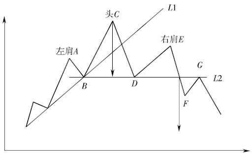
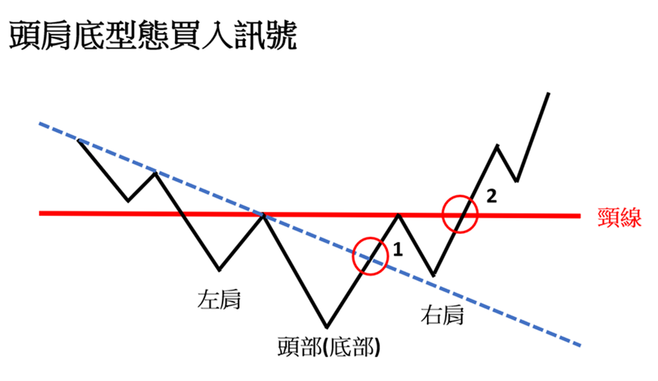
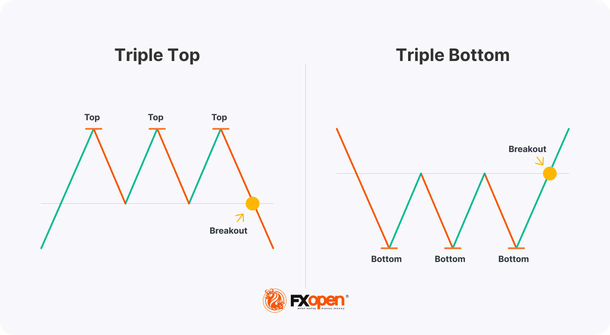
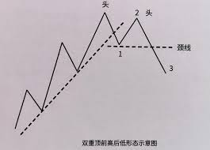
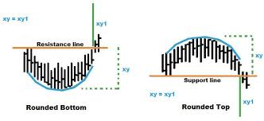
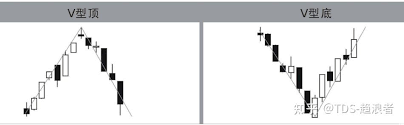

**反转形态**
- 趋势正在发生重要的反转。主要图形包含了头肩形、三重顶（底）、双重顶（底）、V字顶（底）和圆形顶（底）等等。
- 交易量对所在的价格形态起到了验证作用，形式不明的情况下是判断当前价格形态是否可靠的决定性办法。
- 绝大多数价格形态具有价格测算技术，可以确定最小价格目标，帮助估计风险比。（最大的价格目标就是反转之后回撤到趋势起点）
  
**共性**
- **前提**：市场已经存在明确的趋势方向
- **前兆**：现行趋势即将反转的第一个信号经常是**重要**趋势线被突破
- 形态规模和随之而来的市场动作正相关
- 顶部形态酝酿时间通常短于底部形态（价格范围通常较小），但波动强
- 交易量用于验证**向上突破**更具参考价值。在底部形态反转过程中，交易量的扩张是必须的，如果向上突破时交易量没有显著增长的趋势，那么可靠性值得怀疑。

#### 1. 头肩形

| 点位 | 交易量 | 备注 |
|:-------|:--------:|-------:|
| **A** | 交易量随上升到价格新高扩张($V_A$)  | 点B作为相应的调整位，交易量会见轻 |
| **C**  | 交易量同A点相比减少($V_C < V_A$) 非必要条件    | 价格向上突破A，形成头部。后期价格回撤低于左肩A高点，几乎到达B点。   |
|**E**   |交易更轻($V_E < V_C < V_A$)|E最多冲击到CD间一半到三分之二之间。形成了依次下降的波峰|

头肩顶中的“左肩+头”其实就是上升趋势中一次上升的波峰浪谷，头部（C）回撤至D点突破上升趋势线，构成危险信号，这是一个平多的地方，但还不足以开空仓。

右肩E低于头C，可以根据依次下降的波峰画出下降趋势线，但还需观望依次下降的波谷。

**颈线BD**被突破之后，确立头肩形态完成。颈线一般轻微上斜，较平缓。突破时必须收拾价格明确突破到BD之下才行，这样就满足下降趋势线的所有条件，依次降低的波峰和波谷。

颈线突破之后会有**反扑**，价格重新回弹颈线位置（或D点），因为被突破后形成了阻力位置。交易量有助于推测反扑强度，带量的突破一般反扑较小。但无论如何，反扑时的交易量不应该太大，随后恢复下降。
##### 1.1 构成要素
- 上升趋势
- 左肩交易量较重，随后回调
- 头部带着较轻交易量冲击新高成功
- 头部之后回调，跌破左肩高点，靠近前一个向上反弹位置（B）
- 右肩无法冲过头部高点，并且交易量与前两次相比更轻
- 收市低于颈线，反扑之后继续下降
##### 1.2 价格测算
1. 头部至对应颈线垂直距离 （C -> BD）
2. 在突破位置向下做出等距垂直线
此位置仅仅是最近的价格目标，实际上，价格运动经常超过该目标。最大目标是原先趋势的整个范围（起点处）。

形态高度越大，那么波动性越大，其“前程”也就越远。价格在突破趋势线后所走出的距离同它在趋势线上经过的距离相当。

从价格形态确定价格目标必须考虑其余技术因素。如果测算目标同清晰的支撑和阻挡水平只有微小的差距，应该把价格目标调整到阻挡支撑水平。

#### 2. 倒头肩形

| 点位 | 交易量 | 备注 |
|:-------|:--------:|:-------:|
|左肩|-|下跌时可能放量，反弹时缩量|
|头|头部之后回弹的交易量会增加，会超过左肩反弹时的交易量水平|头部的交易量可能比左肩稍有减少|
|右肩|右肩下跌时的交易量比较轻；右肩后回调反弹带量（$v_2 > V_1$）|颈线被突破后交易活动爆发性扩张，与头肩顶最明显的区别|

**头肩底**有时候也被称为倒头肩形。在价格（收市价）明确的向上突破颈线时，头肩底形态确立成功。但是头肩底部形态在颈线突破之后更容易反扑。

价格有因“自重而下跌”的倾向性，因此在底部形态时，市场力图发动一轮牛市时，必须具有**较多的交易量**才行。
##### 2.1 构成要素
- 下降趋势
- 交易量前半部分与头肩顶相似，头部比左肩稍有减少
- 头部回弹交易量经常超过左肩反弹交易量
- 头部之后回调突破左肩高点，靠近上一个反弹位置
- 右肩无法冲过低点，之后反弹明显爆发式带量
- 收市高于颈线，经常性出现反扑

##### 2.2 价格测算
与头肩顶方法相同。

并非所有交易者都是等到颈线突破才开立头寸，因为太迟了。很多大胆的技术策略在相信自己明确头肩底，右肩形成过程或下跌完结第一个信号中就开始买进。

1、右肩形成过程中
- 测出头部与其反弹点之间的距离
- 在其50%~66%回撤点买进

2、价格跌到左肩点差不多水平时买入

3、趋势突破
- 利用右肩形成过程中的短期趋势波动，画出一条短期下降趋势线
- 趋势线突破之后就买进  

#### 3. 流产头肩形
一旦越过颈线，则头肩形态成立，按照规则市场价格不应该返回颈线的另一边。比如，头肩顶颈线向下突破，只要随后任何一个收市价返回颈线上方，都是严重警告，表明此次突破无效，头肩形流产。价格有可能恢复原先趋势。

其一，没有一个形态百发百中，大多数时间成功，但并不是永远如此

其二，必须警惕自己分析中的错误信号，尽快摆脱亏损的头寸交易，确保交易损失限于小额

#### 4. 三重顶和三重底

三重顶和底时头肩形的变体。主要区别在于三重顶或底的三个峰和谷位于大致相同水平上。

三重顶中，交易量随着**相继的峰而递减**，向下突破时则应增加。三重底则情况相反，底部形态完成时，向上突破的交易量很关键。

价格测算中，突破之后至少要走出形态高度的距离。

#### 5. 双重顶和底

双重顶和底比三重的形态更常见，也称之为M顶和W底。在上升趋势中，第一个头部确立了新的高点，通常交易量会增加；然后市场回调（点1），伴随交易量减少。一切都符合上升趋势的正常要求。但在下一轮的冲击中，收市价无力突破前高，接着就开始跌回。双重顶只在收市价跌破前一个回撤低点时才正式成立。交易量倾向于在第一个峰较重，第二个较轻。

双峰之间的持续时间**越长**，形态高度**越大**，反转潜力**越大**。

#### 6. 圆形和底

价格很平缓的从上升变为横向，再从横向转为上升。价格的变化过程极为平缓。在顶部和底部，交易量均随着市场的逐步转向而收缩，最后在新的价格方向占据主动时，又逐步相应增加。

#### 7. V形态

V形态代表剧烈的市场反转，无逐步变化的过程，市场在毫无先兆的情况下突然转向，并无形态可循，本质时非形态的。通常以**反转日**或者**岛形**的形式发生。
- 首先，前有（陡峭或者脱缰）趋势存在，市场持续上涨，一路很少调整或者存在多次跳空
- 市场长着一个方向走的过远，常常会相反的方向突然拉回，无迹可寻
- 反转处交易量重大
- 这种反正唯一的有效信号就是对其非常陡峭趋势线的突破
- 极短时间回撤原先趋势的50%，这是因为原先趋势缺乏支撑和阻挡水平

因为市场顶部被套住的人急于抛售，摆脱亏损，加剧下跌。另一个危险信号时，市场上（尤其在后期）高的非同寻常的持仓量。